# Vision Transformers

## Code structure

All of our code can be found under the `notebooks` folder in our repository. 

## Commands to Reproduce Experiments

In order to run the notebooks we recommend the usage of Google Colab notebooks. 

## Task

The task that we are studying is using various vision transformers to do image classfication. 

## Datasets

We evaluate our approach on 3 publically avaliable datasets. 

#### CIFAR-10

This dataset contains 60k color images which are uniformly distributed accross 10 classes. The images are of size 4x32x32. 
- Alex Krizhevsky. [Learning Multiple Layers of Features from Tiny Images](https://www.cs.toronto.edu/~kriz/learning-features-2009-TR.pdf), 2009.

#### STL-10

This dataset contains 500 training images as well as one thousand testing images per class. Additionally, the dataset also contains 100k unlabeled images, which do not use for training, thus our model doesn't have state of the art performance.

- Adam Coates, Honglak Lee, Andrew Y. Ng. [An Analysis of Single Layer Networks in Unsupervised Feature Learning AISTATS](https://cs.stanford.edu/~acoates/papers/coatesleeng_aistats_2011.pdf), 2011

#### Caltech-101

This dataset consists of colour images of objects belonging to 101 classes. 
- Fei-Fei, Li, Rob Fergus, and Pietro Perona. "[One-shot learning of object categories.](http://vision.stanford.edu/documents/Fei-FeiFergusPerona2006.pdf)" IEEE transactions on pattern analysis and machine intelligence 28.4 (2006): 594-611.

## Experiments

We explore 4 different vision transformer architectures, fine tuning each on 3 different datasets. We conduct analysis on each architecture independently and then compare at the end.

# ViT

The Vision Transformer (ViT) paper introduced a Transformer architecture that can be used for image classification. In our experiments we use the pre-trained Vision Transformer from Hugging Face ([google/vit-base-patch16-224-in21k](https://huggingface.co/google/vit-base-patch16-224-in21k)). It has been pretrained on ImageNet-21K at resolution 224x224 and uses patches of resolution 16x16. All images used in training and testing were preprocessed to fit these dimensions. We fine-tuned the model on the 3 datasets listed above, results can be seen in the graphs and table below. The code is located in `notebooks/ViT.ipynb`, and is based off of [this](https://colab.research.google.com/drive/1Z1lbR_oTSaeodv9tTm11uEhOjhkUx1L4?usp=sharing#scrollTo=szWwJmqPHZ-r) Vision Transformer Tutorial.

For Training Adam optimizer was used with a .0001 learning rate. A linear layer was also added to the last hidden state to classify the results into the specified number of classes per dataset.

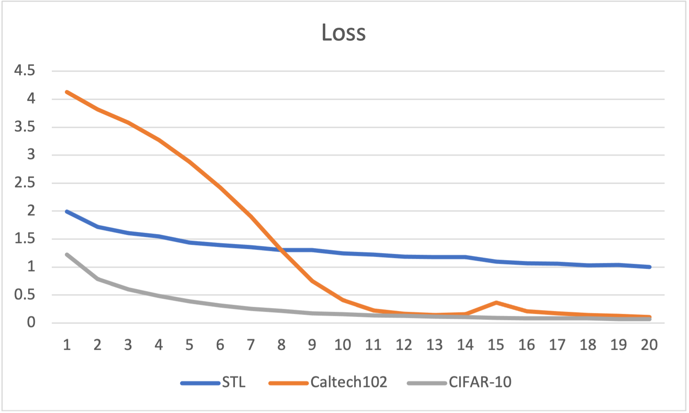

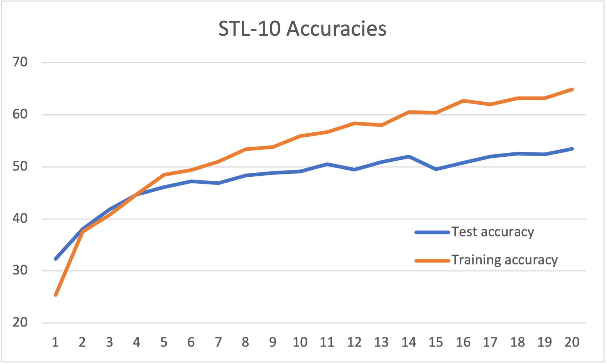

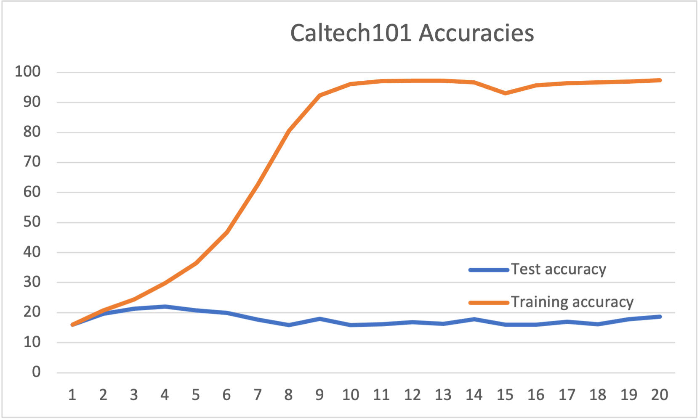

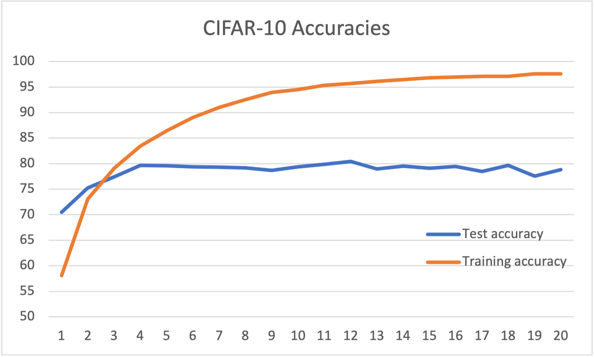

| Datasets/Model | Test Accuracy | Loss | Train Time (20 epochs) | 
|---|---|---|---|
| STL10 | 53.46 | 1.002 | 00:26:40 | 
| Caltech-101 | 21.95 | 0.109| 00:39:40 |
| Cifar-10 | 80.43 | 0.074 | 4:26:00 |

The model was able to reach convergence for Caltech101 and CIFAR-10, based on the trend of the loss when training STL-10 more epochs would be needed for complete convergence.

For the STL-10 dataset the model was not able to get above 53.46 % test accuracy and 64.875 % training accuracy. This is most likely due to the size of the dataset. It was noted in the ViT paper that this model greatly underperforms with smaller dataset.

For the Caltech101 dataset the model was not able to produce a very high test accuracy, only reaching 21.95 %. However, it reached a training accuracy of 97.338 %. This shows that the model very quickly overfitted the training data and reiterates that ViT does not perform well on small datasets. Also of note is that unlike STL-10 and CIFAR-10, Caltech101 is not a subset of image net, meaning it did not benefit as much from the pre-training, which is a possible explanation for why the test accuracy remained so low in comparison to STL-10, since the datasets are comparative in size.

For the CIFAR-10 dataset the model preformed relatively well reaching a test accuracy of 80.43 %, and a training accuracy of 97.567 %. The model clearly performed better on this dataset, most likely due to the increased size of the training set. This can be seen both from the higher test accuracy and the lower training loss.

Overall, Vision Transformer is able to achieve good scores for image classification, but is heavily dependent on large amounts of pre-training data, and large fine tuning datasets.

# BeiT
The Data-efficient image Transformers (DeiT) paper introduces improvements upon the original Vision Transformer (ViT) architecture by proposing a self-supervised vision representation model BEiT. Following the developments of BERT developed for NLP tasks, the authors propose a masked image modeling task to pretrain vision Transformers. Specifically, each image has two views in our pre-training, image patches of size 16x16 pixels, and visual tokens, which are discrete tokens. They first "tokenize" the original image into visual tokens. Then they randomly mask some image patches and fed them into the backbone Transformer. The pre-training objective is to recover the original visual tokens based on the corrupted image patches.

#### Results
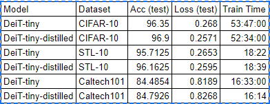 
DeiT Performance | '
:-|-:
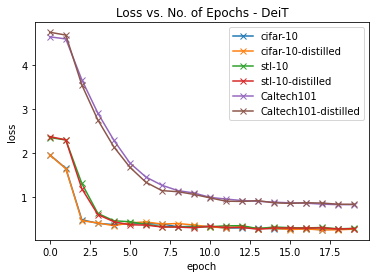  |  

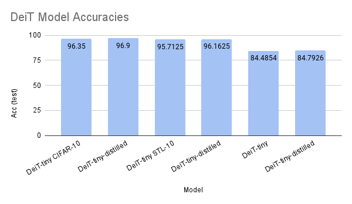 

## References

[DeiT Repository (FB Research)](https://github.com/facebookresearch/deit)

# DeiT
The Data-efficient image Transformers (DeiT) paper introduces improvements upon the original Vision Transformer (ViT) architecture by leveraging knowledge distillation to reach high performance using a smaller dataset. In our experiments we compare performance between the DeiT models and their distilled counterparts to observe the importance of the knowledge distillation introduced in the paper. For all experiments we use the DeiT-tiny architecture (5-6M params) and train for 20 epochs on an NVIDIA 2060ti. Below we show results for training these models across the CIFAR-10, STL-10, and Caltech101 datasets.

#### Results
 
DeiT Performance | '
:-|-:
  |  

 

When performing the fine-tuning experiments in the paper, the authors fine-tuned for 300 epochs compared to the 20 epochs performed here. Despite training for such a short number of epochs, the DeiT models were able to reach high accuracies across all tasks. The distilled models consistently perform better than the base models, showing accuracies around .3-.5% better across the board. Perhaps this gap would be wider had we trained using one of the larger DeiT architectures or fine-tuned over more epochs.

## References

[DeiT Repository (FB Research)](https://github.com/facebookresearch/deit)

# LeViT: a Vision Transformer in ConvNet’s Clothing for Faster Inference

## Summary

### LeViT
LeVit paper utilises recent finding in attention-based architectures which are competitive on highly parallel processing hardware. LeVit outperforms existing convnets and vision transformers on the basis of speed/accuracy tradeoff. We finetuned LeVit by changing various parameters like learning rate, dropout, warm restarts, batch size, etc for 20 epochs. We also trained LeVit for 70 epochs with the same parameters used for ImageNet without fine tuning. 
Below we show results for training these models across the CIFAR-10, STL-10, and Caltech101 datasets. 

### LeViT Implementation

All levit model were trained on 1 gpu. 

Please refer the readme under src/levit/ for running Levit model. 

#### Results

LeVit training loss for 20 epochs for Cifar-10 | LeVit training loss for 70 epochs for Cifar-10 '
:-|-:
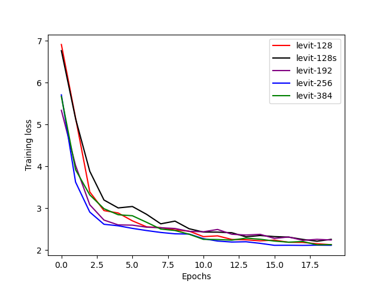  | 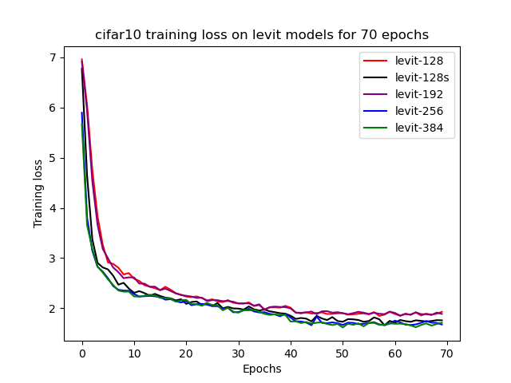

LeVit test accuracy for 20 epochs for Cifar-10 | LeVit test accuracy for 70 epochs for Cifar-10 '
:-|-:
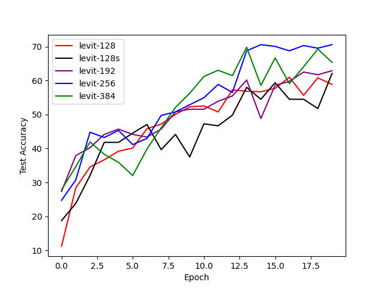  | 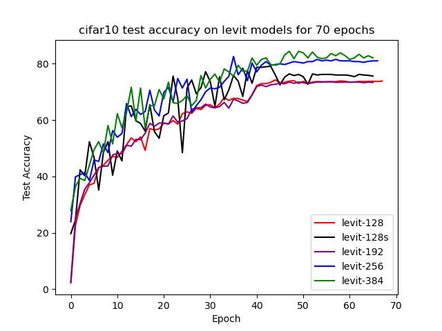

LeVit training loss for 20 epochs for STL10 | LeVit training loss for 70 epochs for STL10   '
:-|-:
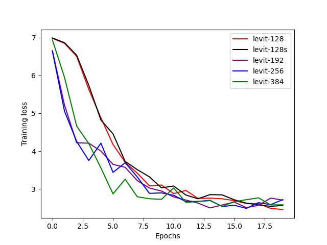  | 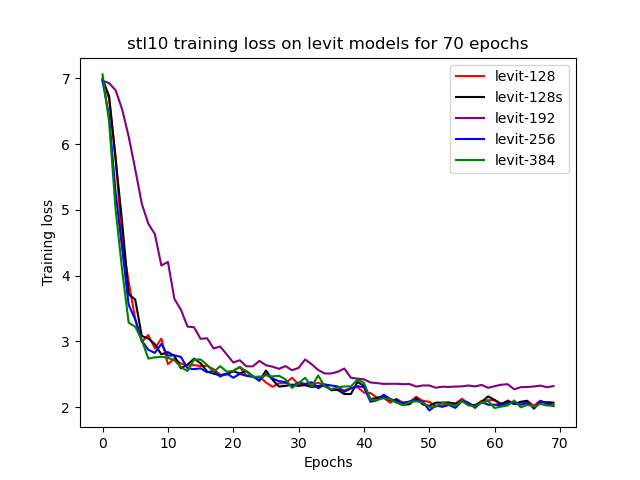 

LeVit test accuracy for 20 epochs for STL10 | LeVit test accuracy for 70 epochs for STL10   '
:-|-:
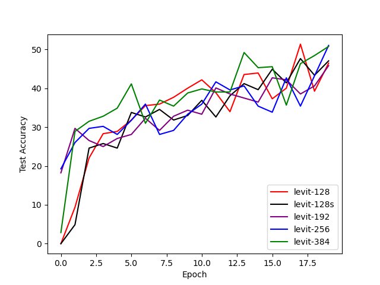  | 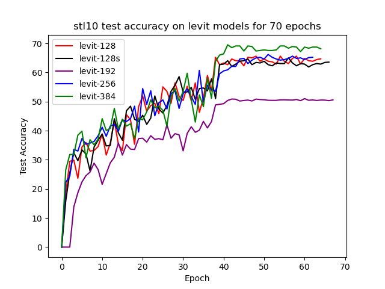

LeVit training loss for 20 epochs for Caltech101 | LeVit training loss for 70 epochs for Caltech101 '
:-|-:
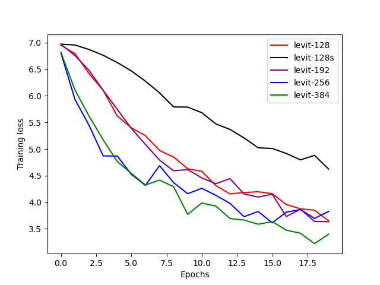  | 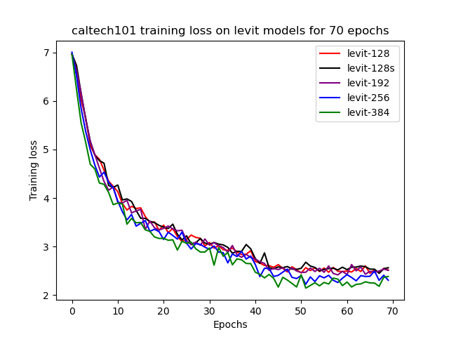

LeVit test accuracy for 20 epochs for Caltech101 | LeVit test accuracy for 70 epochs for Caltech101 '
:-|-:
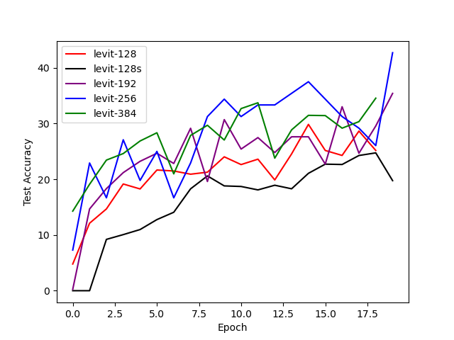  | 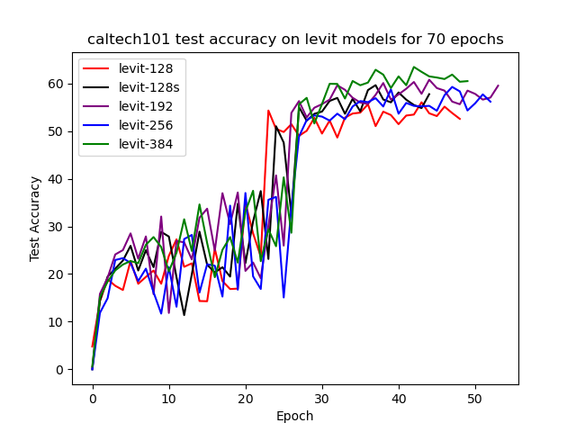 

LeVit training loss for 20 epochs comparison between datasets | LeVit training loss for 70 epochs comparison between datasets '
:-|-:
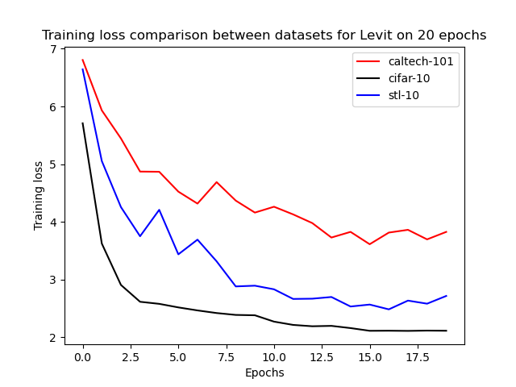  | 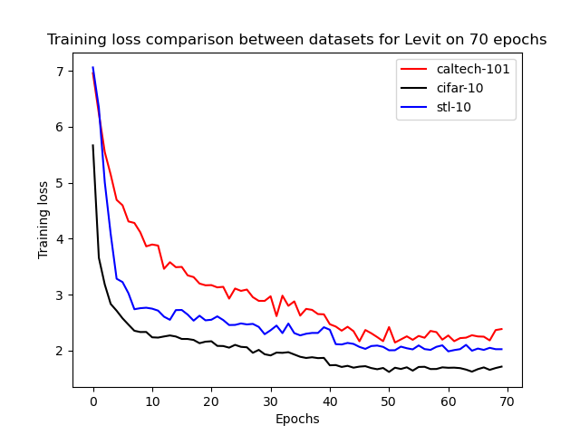 

LeVit test accuracy for 20 epochs comparison between datasets | LeVit test accuracy for 70 epochs comparison between datasets   '
:-|-:
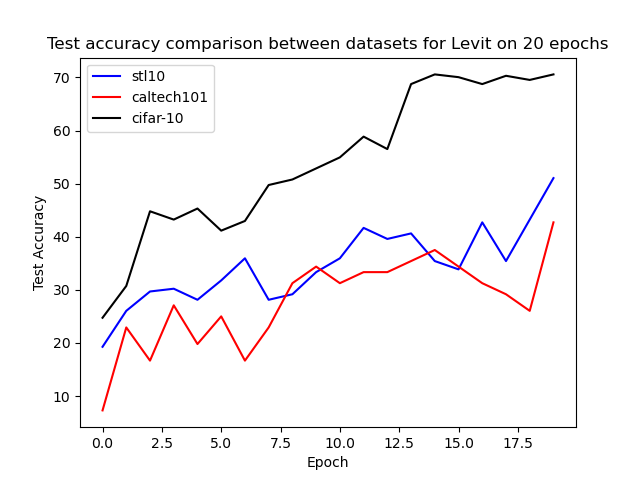  | 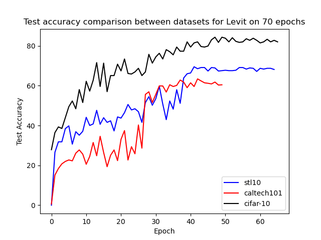

## Table comparing various LeVit models (trained for 70 epochs)

| Models | Train Loss | Test Loss | Train time (in min) | Test time (in min) | Test Acc@1 | Test Acc@5 |  
|---|---|---|---|---|---|---|
|  LeVit-128 (Cifar-10) | 1.931 | 0.828 | 428.807 | 238.621 | 73.825 | 98.311 |
|  LeVit-128s (Cifar-10) | 1.761 | 0.682 | 249.963 | 73.316 | 75.586 | 99.219 |
|  LeVit-192 (Cifar-10) | 1.888 | 0.845 | 512.539 | 242.25 | 73.336 | 98.666 |
|  LeVit-256 (Cifar-10) | 1.678 | 0.628 | 313.23 | 59.904 | 80.989 | 99.349 |
|  LeVit-384 (Cifar-10) | 1.713 | 0.559 | 355.34 | 60.237 | 82.031 | 99.739 |
|  LeVit-128 (STL10) | 2.04 | 1.126 | 178.68 | 84.399 | 64.713 | 94.856 | 
|  LeVit-128s (STL10) | 2.069 | 1.101 | 170.059 | 81.255 | 63.574 | 97.851 |
|  LeVit-192 (STL10) | 2.32 | 1.423 | 513.478 | 277.384 | 50.589 | 94.336 |
|  LeVit-256 (STL10) | 2.0165 | 1.119 | 170.899 | 85.664 | 65.234 | 95.898 |
|  LeVit-384 (STL10) | 2.025 | 1.058 | 177.077| 86.285 | 68.164 | 95.703 |
|  LeVit-128 (Caltech-101) | 2.517 | 1.956 | 211.669 | 165.241 | 52.554 | 74.086 |
|  LeVit-128s (Caltech-101) | 2.564 | 1.853 | 194.173 | 156.433  | 57.734 | 77.574 |
|  LeVit-192 (Caltech-101) | 2.511 | 1.759 | 206.402 | 157.154 | 59.516 | 80.929 |
|  LeVit-256 (Caltech-101) | 2.308 | 1.831 | 204.753 | 166.664| 56.16 | 78.297 |
|  LeVit-384 (Caltech-101) | 2.385 | 1.65 | 206.753 | 170.048 | 60.476 | 81.422  |

## Observations

1) With increasing the epochs without much finetuning, the performance of the all the LeVit models on all the datasets have improved significantly. 
2) On all the datasets, the training loss of LeVit-384 is minimum.
3) On all the datasets, the test accuracy of LeVit-256 is highest within 20 epochs but test accuracy of LeVit-384 is highest after the initial 30-40 epochs.
4) Cifar-10 reaches an accuracy of 70.5 percent after fine-tuning for 20 epochs whereas Cifar-10 reaches an accuracy of 82 percent for 70 epochs with default parameters.
5) STL10 reaches an accuracy of 51 percent after fine-tuning for 20 epochs whereas STL10 reaches an accuracy of 68 percent for 79 epochs with default parameters. At around 40th epoch, there is a jump in the accuracy for SL10.
6) Caltech-101 reaches an accuracy of 42.7 percent after fine-tuning for 20 epochs whereas Caltech-101 reaches an accuracy of 60.5 percent for 70 epochs with default parameters. At around the 25th epoch, there is a significant jump in the accuracy for Caltech-101.
7) The performance of LeVit-128s is better for all the datasets with a small degradation in accuracy compared to other models. 
8) LeVit-128/LeVit-192 takes most time to train for all datasets with accuracy lesser than LeVit-256/LeVit284.

## References

[Pytorch image models](https://github.com/rwightman/pytorch-image-models)
[Vision Transformer Tutorial](https://colab.research.google.com/drive/1Z1lbR_oTSaeodv9tTm11uEhOjhkUx1L4?usp=sharing#scrollTo=szWwJmqPHZ-r)

### Accuracy comparsion of vision transformers between datasets (trained till 20 epochs) 

| Datasets/Model | ViT | DeiT | LeVit | PVT |
|---|---|---|---|---|
| Cifar-10 | 80.43 | 96.9 | 70.57 |  | 
| Caltech-101 | 21.95 | 84.79 | 42.708 |  | 
| STL10 | 53.46 | 96.16 | 51.042 |  |  

